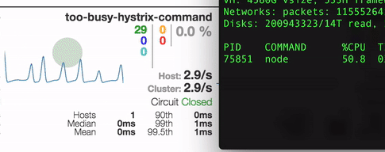

# express-hystrix

The module provides a middleware that wraps every http incoming request into a hystrix command that provides fail fast behavior as well as exposes metrics for every express route.

[](https://codecov.io/gh/dimichgh/express-hystrix)
[](https://travis-ci.org/dimichgh/express-hystrix) [](https://www.npmjs.com/package/express-hystrix)
[](http://npm-stat.com/charts.html?package=express-hystrix)
[](https://snyk.io/test/github/dimichgh/express-hystrix)



### The idea

Hystrix component proved to be really useful in the service client pipeline to follow fail fast pattern as well as provide real-time metrics. This case intends to make service clients 'nice' to the services to avoid overloading them in times of stress. But from service point of view the service does not know who is going to call it and how, especially when it is exposed to the external traffic.

Given the above, why not provide them same hystrix capabilities to frontend and backend side and forcing all clients to be 'nice'?

This modules provides exactly that.

### Possible use-cases

* Allow to quickly short circuit all unknown requests and prevent them from going through the pipeline and consuming precious CPU time.
* Release back pressure when the circuit is open
  * It can also react differently to this event
    * 503 mostly for services
    * connection reset to initiate browser dns fallback with exponential backoff
* Act as a rate limiter or DDoS protector
* Provide valuable runtime metrics
* Group routes into commands and assign different circuit breaker strategies.
    * By controlling when circuit gets open we can assign higher priorities to important commands and short circuit less important in times of stress.
* Configure (enable/disable) specific routes via config of admin console.

### Install

```
$ npm install express-hystrix -S
```

### Usage

```js
const app = express();
const commandFactory = require('express-hystrix');

app.use(commandFactory());
```

### Configuration

#### Custom command runner

The module provides a default command executor based on the request flow or a developer can provide his own.

The executor signature has following spec:
    function runCommand(command, req, res, next): Promise

* __command__ is a command name for the given request.
* __req, res__ are express request flow parameters.
* __next__ is express next handler that must be called once promise is returned to continue request flow
* __returns__ a Promise that if resolved, will mark hytsrix command as SUCCESS, otherwise as FAILURE.

Example:

```js
app.use(commandFactory({
    runCommand: (command, req, res, next) => {
        return new Promise(resolve, reject) {
            // mock some logic that needs to be executed to decide on command status
            setTimeout(resolve, 100);
            // continue flow, which can be in sync or async in relation to command execution
            // it depends of requirements
            next();
        };
    }
}));
```

#### Custom fallback

The module provides a default fallback handler based on the request flow.

The default fallback will check first if any data has been written to the client and reject quietly, otherwise it will call a fallback.

If one provides his own fallback, he must take the above edge-cases into consideration.

The fallback signature:
    function fallback(err, command, req, res, next): Promise

* __returns__ a Promise that if resolved will mark fallback as FALLBACK_SUCCESS, otherwise as FALLBACK_FAILURE.

```js
app.use(commandFactory({
    fallback: (err, command, req, res, next) => {
        return new Promise(resolve, reject) {
            // mock some logic that needs to be executed to decide on command status
            setTimeout(resolve, 100); // mark fallback as success
            // continue flow, which can be in sync or async in relation to command execution
            // it depends of requirements
            next();
        };
    }
}));
```

#### Hystrix configuration

The module allows to provide default hystrix configuration for all command as well as customize configuration for specific command.

##### Default configuration

```js
const app = express();
const commandFactory = require('express-hystrix');

app.use(commandFactory({
    hystrix: {
        default: {
            circuitBreakerErrorThresholdPercentage: 50,
            circuitBreakerForceClosed: false,
            circuitBreakerForceOpened: false,
            circuitBreakerRequestVolumeThreshold: 20,
            circuitBreakerSleepWindowInMilliseconds: 5000,
            requestVolumeRejectionThreshold: 0,
            statisticalWindowNumberOfBuckets: 10,
            statisticalWindowLength: 10000,
            percentileWindowNumberOfBuckets: 6,
            percentileWindowLength: 60000
        }
    }
}));
```

##### Command specific hystrix configuration

```js
const app = express();
const commandFactory = require('express-hystrix');

app.use(commandFactory({
    hystrix: {
        default: {
            circuitBreakerErrorThresholdPercentage: 50,
            circuitBreakerForceClosed: false,
            circuitBreakerForceOpened: false,
        },
        listCommand: {
            circuitBreakerRequestVolumeThreshold: 20,
            circuitBreakerSleepWindowInMilliseconds: 5000,
            requestVolumeRejectionThreshold: 0,
        },
        postCommand: {
            circuitBreakerRequestVolumeThreshold: 2
        }
    }
}));
```

__NOTE__ One needs to specify only config parameters that are different from the ones provided in default settings

#### Customizing command execution strategy

This allows to plug a custom hystrix command runner. By default it uses a simple express middleware handler.

Plugging a custom command runner can be useful, for example, if you would like add too-busy capability.

Here's how one can do it:

```js
const app = express();
const commandFactory = require('express-hystrix');
const Toobusy = require('hystrix-too-busy');

function tooBusyFactory(config) {
    Toobusy.init(config);

    return function commandExecutor(command, req, res, next) {
        return new Promise((resolve, reject) => {
            Toobusy.getStatus(command, busy => {
                setImmediate(next);
                if (busy) {
                    return reject(new Error('TooBusy'));
                }
                resolve();
            });
        });
    };
}

app.use(commandFactory({
    commandExecutorFactory: tooBusyFactory
}));
```

#### Resolving hystrix command

By default the module will use req.path as a command name which may not be what developers would like to use.
In such a case the module allows to customize a resolution command which can be mapped to the given route or routes or based on request headers information.

```js
const app = express();
const commandFactory = require('express-hystrix');

app.use(commandFactory({
    commandResolver: req => {
        return req.path === '/' ? 'home' : 'error';
    }
}));
```

#### Resolving command state

Since most of the time there is no error that would trigger edge case event for circuit breaker, the module provides a way to resolve command status based on response core as well as request metadata which may affect future circuit state for the given command.

```js
const app = express();
const commandFactory = require('express-hystrix');

app.use(commandFactory({
    commandStatusResolver: (err, req, res) => {
        if (res.statusCode === 404) {
            Promise.reject(new Error('Bad path'));
        }
        // mock failure for all requests
        return Promise.resolve();
    }
}));
```

#### Hystrix fallback

Even though the module is based on hystrix the fallback functionality is not directly customizable due to the nature of reacting by circuit breaker to the state of request/response flow after it is already sent back to the client partially or in full. The hystrix is used to record events to be able to react to subsequent events of the same nature (handling same route/request.)

There are two use cases:
* Reacting to the response that has been already written to the output. Here we just record metrics and events.
* Reacting to open circuit event in which case the fallback would call next(err) which will give an opportunity to the developer to provide a fallback option.

```js
const app = express();
const commandFactory = require('express-hystrix');

app.use(commandFactory({
    commandStatusResolver: (err, req, res) => {
        if (res.statusCode === 404) {
            Promise.reject(new Error('Bad path'));
        }
        return Promise.resolve();
    }
}));
// handle open circuit event
app.use((err, req, res, next) => {
    if (err && err.message === 'OpenCircuitError') {
        res.status(500).end('Circuit is open');
        return;
    }
    // continue to the next error handler
    next(err);
});
```
